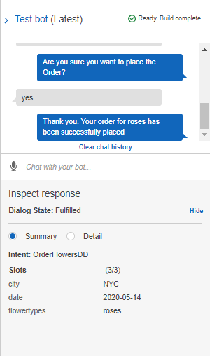
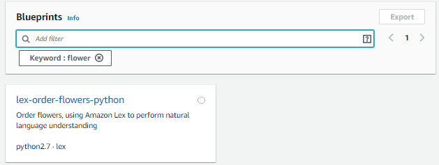

# Chatbot con Amazon

- [Chatbot con Amazon](#chatbot-con-amazon)
  - [Planteamiento del problema](#planteamiento-del-problema)
  - [¿Qué es un Chatbot?](#%c2%bfqu%c3%a9-es-un-chatbot)
  - [Amazon Lex](#amazon-lex)
  - [Terminologías centrales](#terminolog%c3%adas-centrales)
  - [¿Cómo opera Amazon Lex?](#%c2%bfc%c3%b3mo-opera-amazon-lex)
  - [Crear el chatbot en la consola de Amazon](#crear-el-chatbot-en-la-consola-de-amazon)
  - [¿Qué es AWS CloudFormation?](#%c2%bfqu%c3%a9-es-aws-cloudformation)
    - [Usar AWS CloudFormation](#usar-aws-cloudformation)
  - [Trabajo de AWS CodePipeline](#trabajo-de-aws-codepipeline)
    - [Aplicación de demostración de AWS CodePipleine](#aplicaci%c3%b3n-de-demostraci%c3%b3n-de-aws-codepipleine)
  - [Crear y configurar las funciones de Amazon Lambda](#crear-y-configurar-las-funciones-de-amazon-lambda)
  - [Configuración de Amazon Lex](#configuraci%c3%b3n-de-amazon-lex)
  - [Configuración de Cognito](#configuraci%c3%b3n-de-cognito)
  - [Clonar el Repositorio](#clonar-el-repositorio)
  - [Clean](#clean)
  - [Simulación](#simulaci%c3%b3n)

## Planteamiento del problema

Se necesita diseñar un específico flujo de trabajo completo. Se puede determinar el flujo de la conversación como la conversación está yendo a proceder y diseñar todo lo que lo rodea para tratar de hacer un chat bot tan funcional como necesitamos que sea. Tú puedes poner entradas de audio también a través de Amazon Lex y por lo tanto esta es una opción de servicio.

Así que primero determinaremos todo con respecto a la conversación y preguntas solicitadas frecuentes y el script de respuestas a esas preguntas, luego obtendremos el _plug_ en la conversación para _lambda_ y finalmente desplegar esto en cualquier sitio web o integrar con nuestro propio sitio web.

La entrada va a ser un usuario que intenta ordenar flores y luego esa consulta va a ser trasferido al _Servidor Amazon EC2_ desde el cual será pasado a _Amazon Lex_ que luego lo envía al _servidor lambda_ para procesar, lambda no es más que una plataforma imformática de servicio que vamos a usar para procesar las solicitudes, así que en lugar de implementar un servidor completo vamos a usar los servicios de lambda para procesar solicitudes de servicio y luego enviar a _Amazon Cloud Watch_ para monitoreo y una vez que su solicitud haya procesado va a ser enviado de vuelta a _Amazon Lex_ y finalmente intermitiendo a su usuario final. Así, ques esto es toda la arquitectura que usará _Amazon Lambda, Amazon Lex y Amazon Cognito_ para comunicarse con una aplicación dotnet que finalmente se implementará en una instancia EC2 nuevamente.

Se creará un bot de chat de _dotnet core_ usando Amazon Lex. Como objetivo, se creará un bot que básicamente permita a los usuarios tener una conversación sobre el pedido de flores en línea, el bot compartido debería ser idealmente respondiendo una serie de entradas con precisión al implementar este proyecto.

## ¿Qué es un Chatbot?

Un **chatbot** no es más que un programa de computadora que está construido para establecer idealmente una conversación donde hay una entrada y salida en lenguaje natural a través del habla o texto al usuario final. El bot básicamente debería entender las necesidades del usuario, la intención básica del usuario y enviar una adecuada respuesta basada en las políticas de su organización o negocios.

Ahora un par de _bots_ de chat de datos básicamente eliminan mucha redundancia en un determinado sitio web y a menudo usan como agentes de conversación que imitan lo escrito o habla humana con el fin de simular una interacción con la persona real de modo que hay dos formas principales en que los chatbots se ofrecen a los visitantes, uno es a través de aplicaciones web y el segundo a través de aplicaciones independientes en una implementación más avanzada, un chatbor puede ser potencialmente impulsado por ML o aprendizaje automático para detectar conversaciones más complejas.

El primer chatbot _Elisa_ fue construido en 1966 para imitar conversaciones humanas. 

## Amazon Lex

**AWS** tiene un arsenal de servicios, uno de los cuales es _Amazon Lex_, que es básicamente un servicio para construir interfaces conversacionales en cualquier aplicación usando voz y texto. 
Cuando hablamos de sistemas de conversación integrados estamos hablando de sistemas que pueden interpretar fácilmente una entrada dada a ellos ahora esta entrada puede ser en voz o vía de texto. Por ejemplo, tenemos la propia _Alexa_ de _Amazon_, _Google Home_ de _Google_ y luego tenemos ejemplos de comandos de texto que puede ser cualquiera de las aplicaciones de comida como _Zomato_ y de entrega como _Dunzo_ o el sitio web de _GoDaddy_, así que hay un par de maneras a través del cual podemos dar comandos a nuestro sistema que luego procesará y dará nuestra salida deseada.
Así que necesitamos entender un idioma como el inglés el significado de ciertas palabras las frasese cambian junto con el contexto, por ejemplo, la palabra _engaged_ podría ser un comprometido comprometiéndose con su prometida o comprometido podría ser también alumnos, muy comprometidos en este proyecto, entonces tenemos dos contextos diferentes con una palabra. Así, que necesitamos que nuestro _bot_ entienda no solo los significados de las palabras sino también el contexto en el que se usan las palabras para que pueda dar una respuesta apropiada. Entonces, la tecnología que se utiliza para esto se conoce como **procesamiento del lenguaje natural**, es básicamente un subcampo de la ingeniería de la información, a veces, también se considera subcampo de inteligencia artificial el cuál se preocupa por las interacciones entre las computadoras y seres humanos o lenguajes naturales, particularmente, cómo programar computadoras para procesar y analizar grandes cantidades de datos de lenguaje natural, ahora aparte de ese chatbot también usa algo conocido como _ASR_ o reconocimiento automático de voz; es la tecnología que nos permite como usuarios humanos usar nuestra voz para hablar con una interfaz de computadora como un chatbot de tal manera que en su forma más sofisticada de variaciones que probablemente se parecerán en la conversación humana normal que debería ser como si estubieras hablando con otro ser humano como si todos tuviéramos formas diferentes en el que pronunciamos cosas ya que todos venimos de diferentes geografías y tenemos diferentes dialectos, así que cuando usamos el habla como una entrada necesitamos un chatbot para entender nuestro dialecto.

## Terminologías centrales
 
Veremos los múltiples componentes y terminologías de _Amazon Lex_ que usaremos en esta sesión:

* **Amazon Bot:** Es un programa que simula una conversación interactiva, una conversación similar a la humana. El objetivo, es crear al final de la sessión un bot desplegable funcional.
* **Intent:**  Representa la acción que quieres que realice el bot.

## ¿Cómo opera Amazon Lex?

Pasos típicos que se siguen cuando se trabaja con Amazon Lex:

1. Crear un chatbot y configurar con _intents, slots y expresiones._
2. Desplegar el bot en una ventana de prueba proporcionada por la _Consola de Lex._
3. Publicar una version y crear un _alias_.
4. Desplegar el bot en una plataforma.

## Crear el chatbot en la consola de Amazon

1. Ingresar a la _Consola de Administración de AWS_, luego verficar la ubicación en la parte superior derecha. Finalmente, en el buscador escribir _Amazon Lex_ y seleccionar el servicio.

2. Entonces se mostrará el siguiente panel, dar click en get Start_

3. Esto llevará al tablero, donde puedes crear tu propio bot, o probar los boots de muestra: _Book Trip_, _Order Flowers_ y _ScheduleAppointment_. 
   

   
4. Nuestro objetivo es crear un pedido de flores pero no vamos a usar la muestra, crearemos uno desde cero. Entonces seleccionamos **Custom bot.**
Entonces elegir un nombre para el bot, el idioma, luego se puede elegir la voz de salida (al hacer click en una voz te dará una muestra), un tiempo de espera de la sesión, si deseas activar el análisis de sentimientos, y una protección con CCPPA.
De momento solamente está disponible el idioma inglés.

5. Click en Create. En la sesión de intent se deberá elegir un objetivo particular que se desea lograr a través de este bot y luego el medio que desea que los usuarios invoquen su intención sobre cómo debe procesarse las preguntas que se le hacen al usuario para ingresar datos y finalmente algo de lógica requerido para cumplir esa intención particular. Entonces, click en _Create intent_

6. Colocar un nombre y dar click en _Add._

7. Empezaremos agregando enunciados, estos son básicamente las entradas que creemos que vamos a obtener de los usuarios.

8. Ahora en _Slots_ seleccionamos las preguntas que hará para poder hacer la entrega encogiendo de diferentes ranuras predefinidas, empezando por la _ciudad_, el _tipo de flores_.

9. Para las flores no hay un tipo de ranura _slot_ personalizado, por lo tanto, en la izaquierda seleccionar _Slot types_ para agregar uno.

10. Click en _Create slot type_ y rellenar con los diferentes tipos de flores que pueden escoger.

 

11. Colocar también un _slot_ para la fecha de entrega. Además, ordenar el orden que se harán las preguntas.

12. Luego verificar el mensaje de confirmación.

13. Agregar una respuesta, se puede personalizar al agregar el _tipo del slot_ entre "{}".

14.  Guardar la instancia y hacer click en _Build_ en la esquina superior para construir el proyecto. 

 

15. Ahora se puede realizar pruebas ingresando texto o voz.

 

 

El test funciona corecctamente en la consola de Amazon. Se ha podido realizar con éxito el pedido de flores.

## ¿Qué es AWS CloudFormation?

AWS CloudFormation permite usar lenguajes de programación o un archivo de texto simple para modelar y aprovisionar todos los recursos que necesitas para las aplicaciones en todas las regiones y cuentas de forma muy automatizada y la transformación de manera segura. Es básicamente para construir tu plan.

¿Qué quiere decir con un plan? Veremos un ejemplo, cuando estamos desplegando un servicio, primero necesitamos configurar un servidor, así que para eso se necesita configurar nuestro _servidor EC2,_ ahora la aplicación también puede necesitar una base de datos, por lo tanto, necesitamos establecer un servicio RDS, aparte de eso, también necesitamos configurar una IP elástica, una base de datos completa, así como un servicio de caché elástica, por lo que puede haber 10 servicios diferentes que deben implementarse para toda la aplicación se ejecute. Para eso tenemos que implementar todos y cada uno de los servicios que acabo de mencionar uno por uno manualmente. Todo se puede implementar, todos juntos usando la _formación de nubes._ 

Usando _formación de nubes_ cada uno de estos servicios será configurado y aprovisionado de acuerdo a sus necesidades, todos y cada uno de los servicios se encuentran en su plan de diseño se configurará exactamente según su configuración utilizando este servicio en particular. 

Así que, básicamente la _formación de nubes_ es un servicio que ayudará a modelar y configurar sus recursos de AWS para que puede gastar menos tiempo manejando esos recursos y más tiempo enfocando en las aplicaciones que se ejecutan en AWS.

Entonces, todos los servicios serán ejecutados con la coreccta configuración usando _formación en la nube,_ y todo está escrito en script JSON

### Usar AWS CloudFormation

1. Ir a **Services** y escribir **CloudFormation** 

2. Esto nos dirige a este servicio.

3. Hacer click en **Create stack**
4. Se puede usar una plantilla fácilmente disponible, como una _URL de Amazon S3_ o se puede cargar un _archivo de plantilla._ Puede usar una _plantilla de muestra._ Seleccionaremos una plantilla de muestra o _Use a sample template._
5. Luego en la sección de _Select a sample template_ escogemos la opción de _LAMP Stack_ usando una sola instancia de _EC2_ o podría ser la opción de _LAMP Stack_ para crear una Stack escalable, de alta disponibilidad, con base de datos de Amazon RDS instantánea para el almacenamiento de los datos de _back-end._ En esta ocasión, decidimos usar la segunda opción (_Multi\_AZ\_Simple_).

6. Click en _View in Designer,_ donde se puede ver la plantilla completa del archivo. Se tiene el grupo de servidores web, el Listener, grupo de seguridad que tiene la configuración de lanzamiento, balanceador de carga. 

Todo está aquí, también todos los parámetros se pueden ver en la barra inferior en formato _JSON_ o _YAML._ Se puede iniciar la capacidad del servidor web, su autoescalado, todo esto se menciona aquí.

## Trabajo de AWS CodePipeline

Es muy similar a algo conocido como _Jenkins._ Pipeline de Jenkins es básicamente un conjunto de complementos que admite, implementando e integrando pipelines de entrega continua en Jenkins. Es en realidad típicamente escrito en un archivo de texto que a su vez se registra en un repositorio de control de fuente del proyecto. AWS CodePipeline, también es una especie de pipeline, es muy similar.

Entonces, imaginemos un equipo escribiendo y desplegando código continuamente, todo eso se guarda en algo conocido como fuente de sistema de gestión de código, es un sistema centralizado como github; supongamos que hay 10, 20, 200, 200 desarrolladores trabajando en lo mismo todos, el código y todas las actualizaciones se almacenarán en este repositorio centralizado. Luego de ser implementado y probado, que se conoce como puesta en escena una vez que obtiene la aprobación del código puede ser empujado a la producción y una vez hecho esto, tiene a sus clientes que consumen y luego darán su opinión que será regresada a los desarrolladores; y de nuevo la producción de aprobación, la etapa de construcción de origen, todo el ciclo se automatizará, no tenemos que invertir tiempo en buscar el código. Esto se conoce como __pipeline__ y eso es lo que es un código de __AWS CodePipleine__, un servicio de entrega continua que puede usar para modelar, visualizar y automatizar los pasos necesarios para lanzar su software. Ayuda a monitorear sus procesos en tiempo real para garantizar procesos de lanzamiento cosistentes, acelera la entrega sin comprometer la calidad y al mismo tiempo mantener un registro del historial del pipeline.

### Aplicación de demostración de AWS CodePipleine
Para ver cómo podemos construir una aplicación de demostración, volveremos a la _consola de AWS._
Si deseas ver toda la documentación del funcionamiento y como desplegar el chatbot en Amazon, visita este [enlace](https://aws.amazon.com/getting-started/hands-on/bots-just-got-better-net-toolkit-lex-lambda-cognito/)

## Crear y configurar las funciones de Amazon Lambda
Para hacerlo funcional para propósitos de inicialización y cumplimiento básicamente por lo que primero que tenemos que hacer es crear y cargar lambda usando el kit de herramientas de AWS para Visual Studio. Se puede descargar Visual Studio de su sitio [oficial](https://visualstudio.microsoft.com/es/) o el [Visual Studio Code](https://code.visualstudio.com/)

1. Abrir __Visual Studio Code__ y en el mercado de extensiones escribir _AWS Toolkit_
2. Instalar _AWS Toolkit_ luego recargar la extensión.

3. Volver a la consola de Amazon, _AWS Management Console_ y buscar __AWS Lambda__.

4. Click en _Create function_.
5. Se observan varios planos disponibles, puede elegir crear desde cero, pero usaremos un plano, escogemos _Use a blueprint_.

 
   
6. Debajo tenemos un par de planos diferentes, usaremos el de order flower, en el buscador escribimos _order._

 
   
7. Click en _Configure_

8. Escribir el nombre de la función, el cual es el nombre de nuestro bot, _orderFlowersDD_ 

 

9. Abajo tenemos el código de la función Lambda. Entonces, hacer click en _Create function._ Esto puede tardar un momento. Podemos ver la barra verde que indica que se ha creado con éxito.

 

10. Click en _Test_ tenemos nuestro evento de pruebas, colocar el nombre del evento _Order Flowers_ y click en Create._ Luego hacer nuevamente click en _Test._ Entonces, luego de probar la función, podemos ver que ha tenido éxito, verificar los detalles donde muestra los resultados. También, se tiene el resumen, el código, la duración que lleva ejecutar, recursos, configuración, etc.

 

Ahora iremos a la configuración del bot de Amazon Lex.

## Configuración de Amazon Lex

1. Volver a la _AWS Management Console_ para editar el bot que habíamos creado anteriormente. Escribimos Amazon Lex y nos dirigimos al enlace. 

 

2. A continuación, ingresar al bot creado _OrderFlowersDD._ Se harán algunas pequeñas modificaciones, en la sección de _Lambda initialization and validation_ marcar la casilla y seleccionar la función lambda. 

 

3. Luego en la ventana emergente agregar permisos al hacer click en _OK_

 

4. Hacer lo mismo en la sección de _Fulfillment_, que estaba simplemente devolviendo parámetros para el cliente; ahora tenemos que procesar la entrada dada por los clientes, porque la principal función de un chatbot no es solo tomar la entrada sino también procesar la entrada que ha sido dada por los clientes, así que con esto hemos configurado nuestro bot.

 

5. Click en _Save Intent_.

## Configuración de Cognito

En esta sección se crea un grupo de identidad de _Amazon Cognito_ para que la aplicación ahora mismo pueda recibir un conjunto de credenciales de AWS Cognito.

1. Ir a _Services_ y seleccionar _Cognito._

 

2. Seleccionar _Manage Identify Pools_, colocar un nombre de identidad _chatbots_, habilitar acceso a identidades no autenticadas, finalmente, click en _Create Pool._

 

3. Click en _Allow_
4. Entonces, obtendremos un fragmento de código para inicializar las credenciales de _Amazon Cognito_ en la sección de _Get AWS Credentials_, aquí tendrás un ID de grupo de identidad en rojo. Así, que asegúrate de copiarlo y pegarlo en algún lugar.

## Clonar el Repositorio

Necesitamos clonar un _repositorio de github_ que contiene la configuración de actualización del código del proyecto, que se ejecutará usando _Visual Studio_.

1. Click en el botón de _Clone the Repo_ en la [sección de implementación](https://aws.amazon.com/getting-started/hands-on/bots-just-got-better-net-toolkit-lex-lambda-cognito/module-four/)

Esto nos direccionará al repositorio en [github](https://github.com/aws-samples/aws-lex-net-chatbot)

2. Click en _Clone or download_ y luego en _Download ZIP_

3. Configurar el IDE, como ya tenemos instalado en _Visual Studio Code_ la extensión de _AWS Toolkit_ tenemos que ingresar nuestra clave AWS y la clave secreta en la pantalla de configuración que tenemos

4. En Visual Studio Code abrir un archivo llamado __appsettings.json__ que es básicamente un archivo JSON. _File>Open File>_ y dentro del repositorio descargado ir a _Code>dotnetLexChatBot_ y abrir el archivo.

 

5. En este archivo pide ingresar todas las especificaciones.

 
  
6. Pondremos la clave que habíamos guardado en _CognitoPoolID_, en _LexBotName_ el nombre del bot.

7. Se puede probar e implementar el chatbot en _Visual Basic_ ejecutando el IDE. Se puede ver y probar la aplicación de chat bot en el navegador web. Este proceso se puede seguir en el paso 4 _Test the Chatbot_ del [tutorial de Amazon](https://aws.amazon.com/getting-started/hands-on/bots-just-got-better-net-toolkit-lex-lambda-cognito/module-four/) Este proceso toma alrededor de 90 minutos, lo que es **importante hacer es limpiar y eliminar recursos, después de hacer otra cosa, se podría incurrir en una factura considerable en su cuenta y eliminar sus recursos adicionales** 

8. Finalmente, eliminar los recursos, seguir el paso 2 de la sección de _Deploy_ llamada _Step 2: Clean Up & Delete Resources_

 

## Clean 

1. Ir a _CloudFormation_
2. Seleccionar el _Stack_
3. Ir al menú desplegable de acciones.
4. Seleccionar la opción de eliminar Stack.
5. Presionar Sí, Eliminar.

## Simulación

 